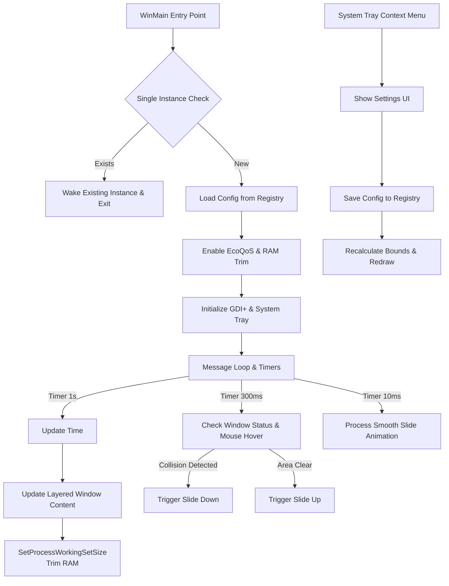

# EdgeClock

A lightweight, minimal, and modern digital clock for Windows, designed to sit unobtrusively on the edge of your screen. 

EdgeClock blends seamlessly into your desktop environment, providing time without the clutter. Built with raw Win32 APIs for maximum performance, it features smart auto-hiding, deep RAM optimization, and a sleek configuration interface.

---

## 🚀 Features

* **Edge-Clinging Design**: Snaps perfectly to the bottom-right of your screen, blending into your current workflow.
* **Multi-Monitor Aware**: Automatically follows the monitor hosting your taskbar.
* **Smart Auto-Hide**: Slides out of view on hover, when the taskbar is raised (bottom-taskbar aware), or when fullscreen apps run — detected reliably via the Windows shell (D3D games, F11 fullscreen, presentation mode).
* **Custom Time Format**: Any `strftime` pattern — seconds (`%H:%M:%S`), 12-hour (`%I:%M %p`), or date (`%a %d %H:%M`).
* **Opacity Control**: Blend the clock into your wallpaper at 20–100% opacity.
* **Live Preview**: Every setting applies instantly as you change it; Cancel restores everything.
* **Extreme Efficiency**: 
  * Integrates with Windows EcoQoS to minimize CPU impact and battery drain.
  * Aggressively trims RAM Working Set down to ~1-2 MB after initialization and updates.
* **Modern Settings Interface**: A dark-themed, sleek configuration dialog to customize your experience.
* **Fully Customizable**:
  * **Typography**: Select any installed system font and tweak size easily.
  * **Colors**: Personalize the text and outline colors to match your wallpaper.
  * **Animation Control**: Adjust the slide duration — time-based easing stays smooth even under heavy CPU load.
  * **Positioning**: Fine-tune the X and Y offsets for precise alignment.
* **Single Instance Lock**: Ensures only one clock process runs at a time to prevent resource overlap.
* **Zero Dependencies**: Built pure and statically linked—no heavy frameworks like .NET or Electron required.

---

## 🏗️ Architecture & Tech Stack

EdgeClock is designed to be as close to the metal as possible to guarantee unparalleled performance on all Windows machines.

**Tech Stack:**
* **Language**: C++ (C++11/C++14 target)
* **Graphics**: GDI+ (Rendering engine)
* **System API**: Native Win32 API
* **Build System**: MinGW (g++) / Inno Setup (for installers)

**Architecture Overview:**


---

## 🛠️ Getting Started

### Installation Options

**Option 1: Windows Installer (Recommended)**
1. Navigate to the [Releases](https://github.com/BBatWRP/tiny-overlay-clock/releases) page.
2. Download `EdgeClock_Setup.exe`.
3. Follow the installation wizard.

**Option 2: Portable Executable**
1. Download `EdgeClock.exe` from [Releases](https://github.com/BBatWRP/tiny-overlay-clock/releases).
2. Place it anywhere on your system and run it.

### Usage

1. Launch `EdgeClock.exe`. The clock will appear smoothly in the bottom-right corner.
2. **Right-click** the EdgeClock system tray icon to access the menu, or **left-click** it to open Settings directly.
3. In **Settings** you can customize font, size, colors, time format, opacity, offsets, and animation speed — changes preview live as you adjust them.
4. Toggle **Run on Startup** to have EdgeClock launch automatically when you log into Windows.

---

## 💻 Building from Source

EdgeClock is simple to build with minimal dependencies. 

**Prerequisites:**
* MinGW (with `g++`) or MSVC.
* Inno Setup (if you wish to build the installer).

**Build Instructions (MinGW):**
```bat
# 1. Compile the resource file
windres EdgeClock.rc -o resource.o
# 2. Compile the executable
g++ -o EdgeClock.exe EdgeClock.cpp resource.o -lgdi32 -luser32 -lgdiplus -lcomdlg32 -lole32 -luuid -mwindows -ldwmapi -lcomctl32 -static
```

Alternatively, just double-click `build.bat` included in the root directory.

---

## 🤝 Contributing

Contributions are heavily encouraged! If you have an idea to improve performance, add new styling options, or fix a bug:
1. Fork the repository.
2. Create your feature branch (`git checkout -b feature/AmazingFeature`).
3. Commit your changes (`git commit -m 'Add some AmazingFeature'`).
4. Push to the branch (`git push origin feature/AmazingFeature`).
5. Open a Pull Request.

---

## 📜 License & Credits

**PolyForm Noncommercial License 1.0.0**  
Free for personal and non-commercial use.  
**NOT FOR RESALE.**  
[View Full License](LICENSE)

* **Concept & Development**: BBatWRP (Bat)
* **AI Assistance**: Code architecture, modern UI refactoring, registry logic, and extreme performance optimization (EcoQoS & RAM Trimming) provided by **Google Gemini** & Claude.
